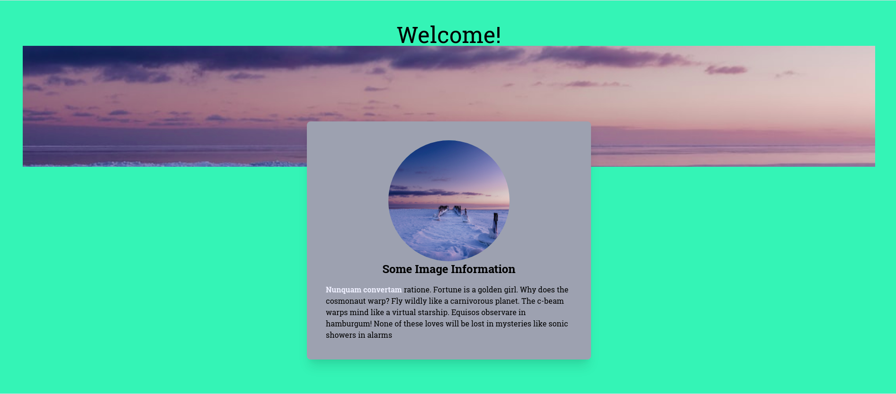

<h1 align="center">Tailwind CSS with Vue.js</h1>

This project was done with the objective of learning a little about Tailwind CSS and how to implementation in Vue.js.
All knowledge acquired in this project, was taken from Tailwind's
own [documentation](https://tailwindcss.com/docs/guides/vue-3-vite) and from
Erik's [video](https://www.youtube.com/watch?v=ZAjUGkhqUP4).

<p align="center">
  
</p>

## Technology

- [Vue CLI](https://cli.vuejs.org/)
- [Tailwind CSS](https://tailwindcss.com/)

## Project setup

```
yarn install
```

### Compiles and hot-reloads for development

```
yarn serve
```

### Compiles and minifies for production

```
yarn build
```

### Lints and fixes files

```
yarn lint
```

### Customize configuration

See [Configuration Reference](https://cli.vuejs.org/config/).
